## Starting an Ubuntu Container

```bash
docker run -it ubuntu
```
### 1. Lookup the Public IP of tremend.com

```bash
apt update && apt install -y dnsutils
nslookup tremend.com
```
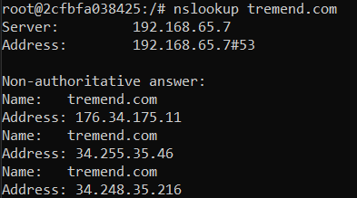

### 2. Map IP address `8.8.8.8` to hostname `google-dns`

```bash
apt install -y nano
nano /etc/hosts
```
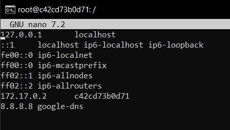

### 3. Check if DNS Port is Open for `google-dns`

```bash
apt update && apt install -y iputils-ping
ping -c 4 google-dns
```
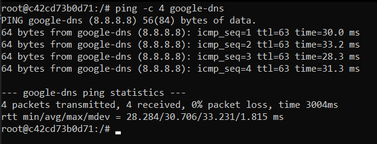

### 4. Change system DNS to Google’s Public DNS (`8.8.8.8`)

```bash
nano /etc/resolv.conf
cat /etc/resolv.conf
```
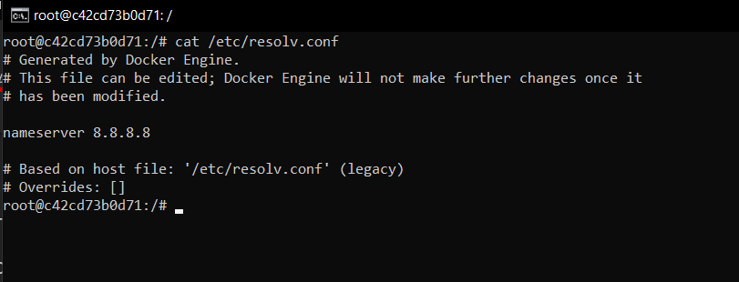

```bash
nslookup tremend.com
```
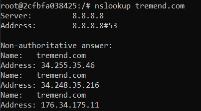

*Notice DNS queries now using Google's DNS.*

### 5. Install and verify Nginx service

```bash
apt install -y nginx
apt install -y systemctl
service nginx status
ps aux | grep nginx
```
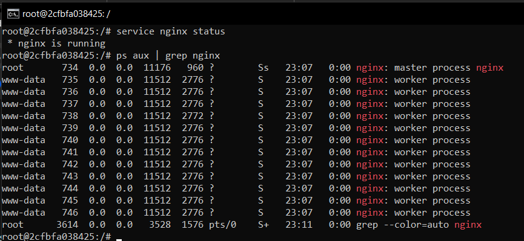

### 6. Find the listening port for Nginx

```bash
ss -tulnp | grep nginx
```
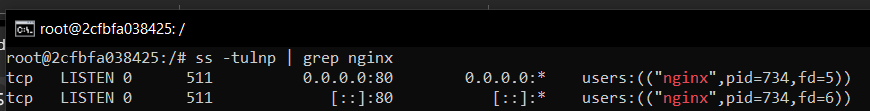


## Bonus Tasks

```bash
nano /etc/nginx/sites-available/default
```
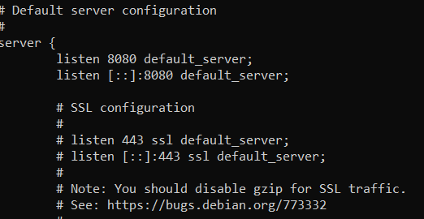

```bash
service nginx restart
```
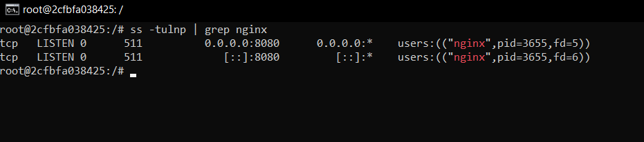

```bash
nano /var/www/html/index.nginx-debian.html
```
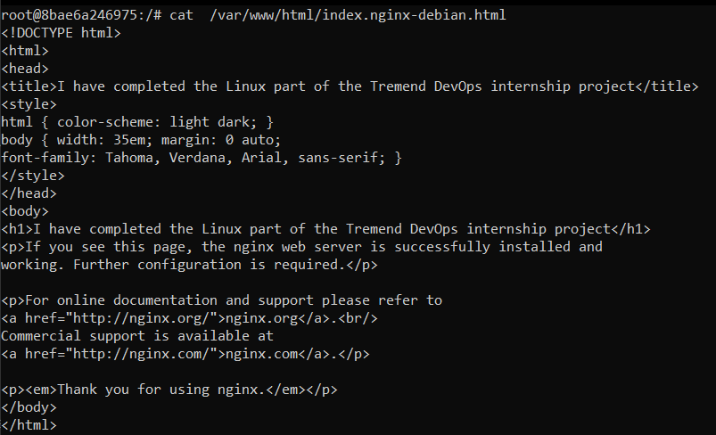
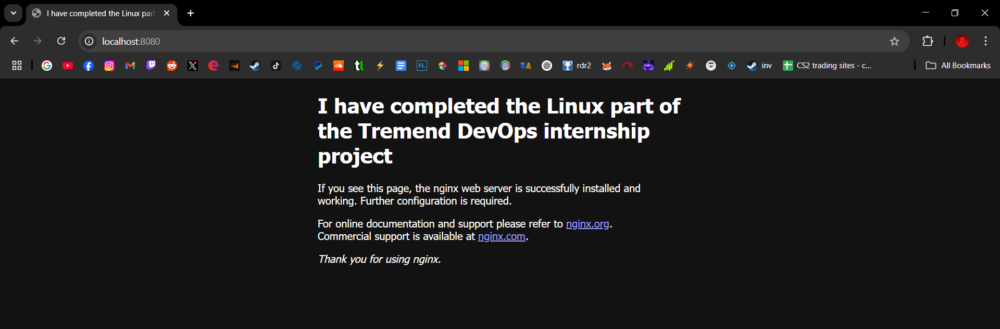