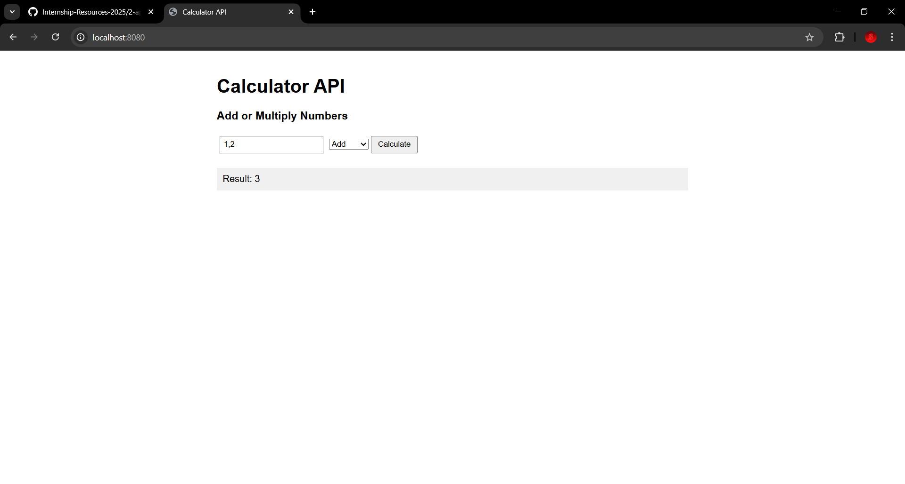
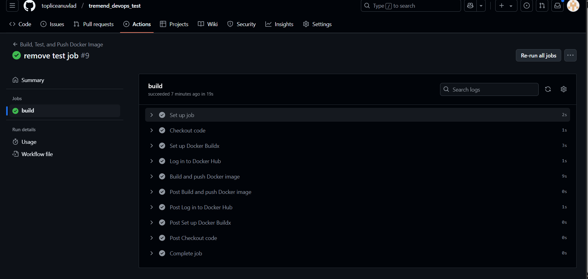
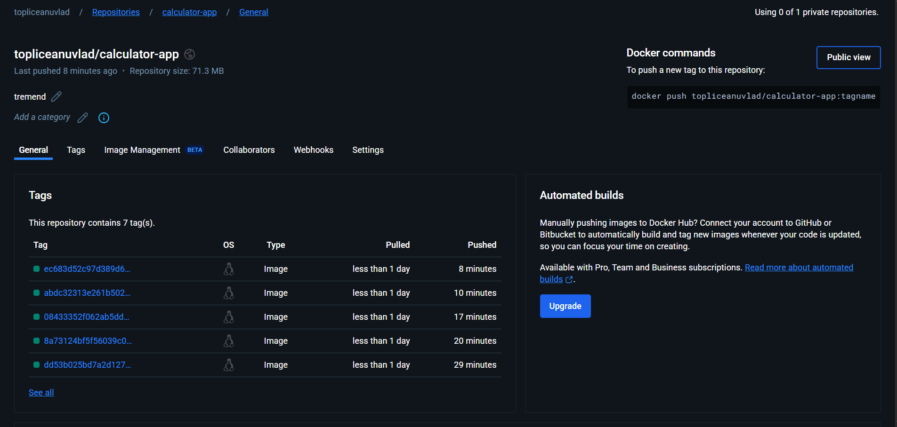

# Calculator API with Docker & CI/CD

## Overview

This project containerizes a Python-based Calculator API using Docker and automates the build, test, and push processes with GitHub Actions.

## Steps Completed

### 1. Containerization with Docker
- Chose the Python Calculator API application.
- Created a Dockerfile to build the image.
- Developed an entrypoint script that runs Gunicorn as PID1.

### 2. Local Testing
- Built the Docker image locally.
- Ran the container and verified the web interface.

- 

### 3. CI/CD with GitHub Actions
- Configured a GitHub Actions workflow triggered by pushes to the main/master branch.
- Automated the build and push of the Docker image to Docker Hub.
- Included a step to run the container, stop it, and verify the graceful shutdown.

## Additional Notes

- Environment variables are configured for sensitive data.
- The solution demonstrates an effective CI/CD pipeline for containerized applications.