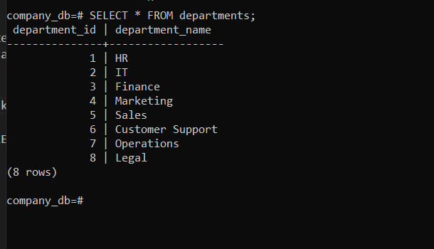
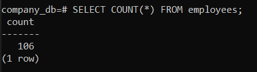
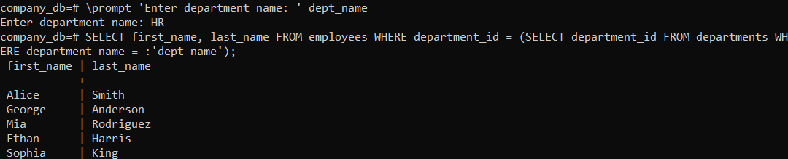
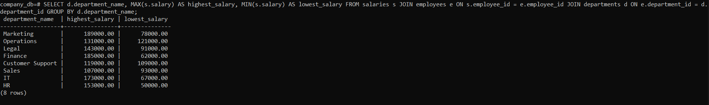
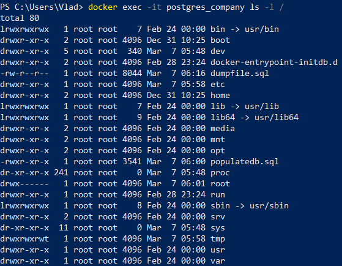
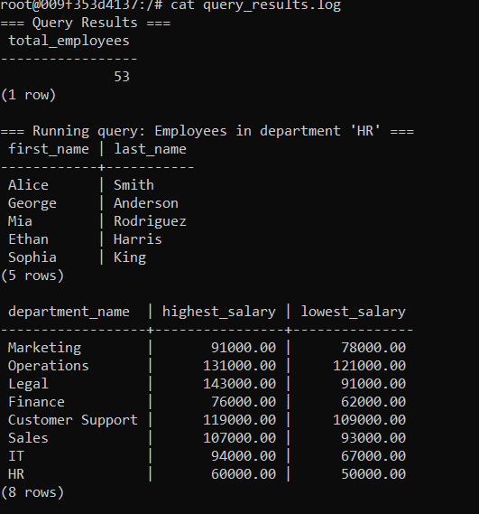

# PostgreSQL Container with Data Import and Queries

## Step 1: Pull and Run PostgreSQL Container
Start a PostgreSQL container with the correct settings.
```bash
docker run -d --name postgres_company -e POSTGRES_USER=tremend -e POSTGRES_PASSWORD=securepassword e POSTGRES_DB=company_db -v pgdata:/var/lib/postgresql/data -p 5432:5432 postgres:latest  


docker run -d --name postgres_company -e POSTGRES_USER=tremend -e POSTGRES_PASSWORD=securepassword e POSTGRES_DB=company_db -v pgdata:/var/lib/postgresql/data -p 5432:5432 postgres:latest
```
## Step 2: Copy Dataset Into Container
Copy the provided SQL file into the running container.
```bash
docker cp "C:\Users\Vlad\Desktop\Internship-Resources-2025-main\Internship-Resources-2025-main\3-db\populatedb.sql" postgres_company:/populatedb.sql
```

## Step 3: Enter the Container Shell
Access the container’s shell to interact directly with PostgreSQL and the file system.

```bash
docker exec -it postgres_company /bin/bash
```
mention: i edited the script because it had a mysql command.

```bash
docker exec postgres_company psql -U tremend -d company_db -f /populatedb.sql
```

## Step 4: Import the Dataset into the Database
Run the SQL script to populate the database.
```bash
docker exec -it postgres_company psql -U tremend -d company_db
```

## Step 5: Verify Data with Queries
After importing, run basic queries to check the data
```bash
SELECT * FROM departments;
```

```bash
SELECT COUNT(*) FROM employees;
```

```bash
\prompt 'Enter department name: ' dept_name
SELECT first_name, last_name FROM employees WHERE department_id = (SELECT department_id FROM departments WHERE department_name = :'dept_name');
```

```bash
SELECT d.department_name, MAX(s.salary) AS highest_salary, MIN(s.salary) AS lowest_salary FROM salaries s JOIN employees e ON s.employee_id = e.employee_id JOIN departments d ON e.department_id = d.department_id GROUP BY d.department_name;
```


## Step 6: Dump the Dataset into a File
Export the entire database into a SQL dump file for backup purposes.
```bash
docker exec postgres_company pg_dump -U tremend -d company_db -f /dumpfile.sql
docker exec -it postgres_company ls -l /
```


## Step 7: Create Automation Script
Create a Bash script to automate the full process (drop, recreate, import, query, dump).
```bash
touch init_company_db.sh
nano init_company_db.sh
chmod +x init_company_db.sh
./init_company_db.sh
cat query_results.log
```


## Optional task already done using the following flag:
```bash
v pgdata:/var/lib/postgresql/data
```